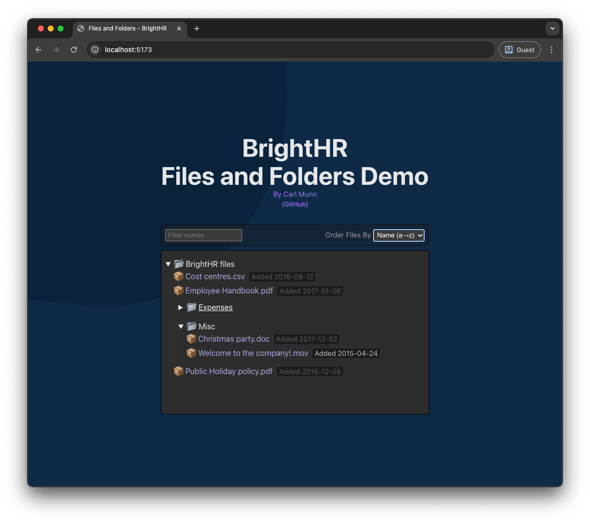

# BrightHR Files and Folders Demo

## By Carl Munn

Simple web page to list file and folders with features to sort and filter files based on specs located on GitHub [repo](https://github.com/brighthr/Front-End-Tech-Tasks/blob/main/junior-and-middleweight.md)

## Usage
- Environment set up first. Node and npm (See Development section below)
- Set up first with `npm install`
- Run tests with `npm run test` (See Testing section below)
- Run with `npm run dev` and follow the host and port supplied in console output

## Development
- Development environment
  - node v22.14.0
  - npm v10.9.2
- I used Mise environment management
- Developed on MacOS (M1) using Chrome 139
  - Tested on Firefox 141 and Safari 18
- Used Vite to get started. Quicker prototyping

### TODOs
- The initial page load doesn't trigger a sort of 'name'
- Better favicon

### Development process
I prototyped and then tested. TDD wasn't necessary since prototyping was quicker for this task. Refactoring was done with the help of tests to make sure nothing broke while cleaning up afterwards. Tests in this scenario would be used to guard against regression and future proof later changes. If the API was more complicated and live TDD would be necessary.

I developed in sprints: plain, prototype, test, prototype, test. refactor. documentation. clean. test. refactor

## Testing
- Using vitest ([docs](https://vitest.dev/api/expect.html))
- Each file's tests are located in a relative directory called `__tests__`
- Run tests with `npm run test`
- Use `#only` to isolate a test
- I have left some tests out that are similar to other tests
  - ie, ordering by 'name' and 'added' are similar so one has more testing than the other
- Using `test/test_data.ts` to keep data in one place

### TODOs
Additional tests for robustness
- Test with future dates
- Test with corrupted structure
- Test with non-ASCII or non-standard characters
- Test with long or missing file names

## Notes
- This GitHub [repo](https://github.com/carlmunn/demo-brighthr-folder-files)
- Templates off Vite
- I would normally place CSS with the React components, but for this demo I used a [god object](https://en.wikipedia.org/wiki/God_object).
- The theme/color is not suitable for accessibility (low contrast). More work on CSS would be needed
- TypeScript
- `#filterNodesByName` does not filter out nodes, it only sets the 'hidden' field to true/false
- Using Git
- Open and close folders via `
` and `
` HTML tags
  - I would normally use a `table` since it works with columns (name, date, extension). Just went with a simple "filename.ext [Date]"
  - Other options could be `ul`/`li`, or CSS `grid`/`flex` elements
- Testing with vitest and msw (http mocking)
- Used the term "Node" (not the language) to represent files and folders
  - "Node" for the tree structure, as file systems are generally set up this way.
- Recursion is used since the folder/file structure is a basic/static tree structure.
  - See the filter/sort utility functions and the NodeList for recursion calls.
- Using path aliases for imports. Defined for TypeScript and Vite (Personal preference)
- Original specs at GitHub [repo](https://github.com/brighthr/Front-End-Tech-Tasks/blob/main/junior-and-middleweight.md)
- I was tempted to have all this in a Docker image for easier demoing but it's outside the scope.
  - For deployment, I would use a Docker container service for this (AWS/Azure/etc)
- Debouncing the filtering sorting would be wise if there was more data. Prevents events from firing on each keypress/change
- React has a Chrome extension for debugging, but I didn’t need to use it
- Ordering and filtering is only applied to files, not folders.
- Assumed modern browsers
  - Used Emojis
  - Used https://shapecatcher.com/ for unicode arrow